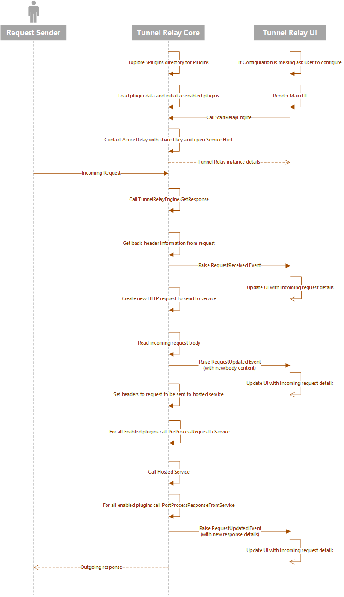

# Tunnel Relay Internals

This document explains how Tunnel Relay processes the request internally. This does not cover any operations done by external components. Refer to following documents for detailed description for respective topics

- [Request Handling](RequestHandling.md)
- [Understanding Plugins](PluginManagement.md)

## High level design
On a high level Tunnel Relay can be split into 3 components

- Tunnel Relay WCF relay
- Tunnel Relay Core engine
- Tunnel Relay UI

## Understanding components

### Tunnel Relay WCF relay
Main functionality of this component is to run a [ServiceHost](https://msdn.microsoft.com/en-us/library/bb332338.aspx) which is built to accept request with any URL pattern and HTTP method. HTTP Trace method is not supported at this point. 

WCF relay is started as part of the application start and is closed only when application exits. Received request is forwarded to Tunnel Relay Core engine for processing and response is sent back to caller.

### Tunnel Relay Core engine
Tunnel relay core engine is the request processor component of Tunnel Relay. It processes requests received from WCF relay and calls other components where needed to perform required operations before sending response back to WCF relay.
Main functionality performed by Core engine includes

1. Start and manage WCF relay, Plugins
1. Create request to be sent to Hosted service
2. Send updates to UI as and when the request progressed through the pipeline
3. Call plugins
4. Create requests and responses while acting as proxy
5. Manage logging

### Tunnel Relay UI
Tunnel relay is used to show to user how the requests are progressing and information about headers and content as received and send back to caller. UI is a loosely coupled component and primarily works on events raised by Core engine.

### Request lifetime

Following diagram describes the lifetime of a request. Individual requests are handled in parallel fashion and don't impact each other.

## FAQs

Q. What is the rate at which Tunnel Relay can process requests?  
A. Tunnel relay has been tested to support more than 5 requests per second.

Q. Do I need a high specification machine to run Tunnel Relay?  
A. Tunnel relay does not require a high specification to run. Although a high request call rate can shoot up the processor usage.
