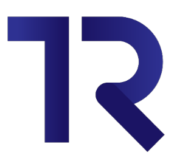

# Tunnel Relay

Tunnel relay allows you to expose local services to the outside world over HTTPS using [Azure Service Bus Relay](https://docs.microsoft.com/en-us/azure/service-bus-relay/relay-wcf-dotnet-get-started).

## Overview
Since most developers don't have static IP addresses for their development machines visible to the external world, it is incredibly cumbersome for them to develop and test services. Tunnel Relay is a free and open-source tool that provides you a static URL for your local service which can be accessed externally!

## Download
Latest release can be downloaded [here](https://github.com/OfficeDev/microsoft-teams-tunnelrelay/releases/latest) 

## Requirements
We wanted to build a solution which was easy to use and works out of the box. Here are the things you need to run Tunnel Relay.

1. Windows with .Net Framework 4.6.1
2. Microsoft Azure subscription (you can sign up for a free trial [here](https://azure.microsoft.com/en-us/free/))

...__**and that is it!**__

## Get Started
Following image explains the basic components of the app. User needs to login before they can start using the app. This is covered in [Configuration](Configuration.md).

## FAQs

Q. Do my clients need to change to understand that they are contacting server over Tunnel Relay vs directly?  
A. Short answer no. All your clients need to see is the url exposed by Tunnel Relay. Rest everything remains the same.

Q. Can I share same Service bus namespace across multiple machines?  
A. Yes, you can share same service bus namespace across multiple machines. Each relay is a unique combination of service bus and machine name.

Q. How much will this cost me?  
A. Tunnel Relay itself is a free, open-source tool, although since Azure Service Bus back it, you will have to pay for the Service Bus itself. Pricing for service bus can be found [here](https://azure.microsoft.com/en-us/pricing/details/service-bus/). Tunnel Relay creates a service bus with __basic tier__. Please look for section WCF Relays to get the pricing information.

Q. I have an issue which needs your attention how can I contact you?  
A. We monitor this Github repo for issues. Please open a new issue or reply to an existing one. We will get back to you soon. 

Q. I want to extend Tunnel Relay. How can I do so?  
A. Tunnel Relay is released under [MIT License](https://opensource.org/licenses/MIT). Please look at the contributing section below if you want to contribute to this project.

## Understand how Tunnel Relay works
Please refer to following options to learn more about Tunnel Relay and its internal workings

1. [Configuration](Configuration.md)
2. [Request Handling](RequestHandling.md) 
3. [Internal Design](InternalDesign.md)
4. [Extending Tunnel Relay - Plugins](PluginManagement.md)

## Issues, problems, feedback, questions?
Please report them [here](https://github.com/OfficeDev/microsoft-teams-tunnelrelay/issues)

## Contributing

This project has adopted the [Microsoft Open Source Code of Conduct](https://opensource.microsoft.com/codeofconduct/). For more information see the [Code of Conduct FAQ](https://opensource.microsoft.com/codeofconduct/faq/) or contact [opencode@microsoft.com](mailto:opencode@microsoft.com) with any additional questions or comments.
